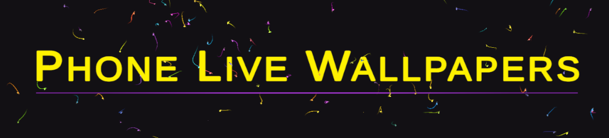

  
    
    

  
  Your Phone Alongside Your Computer ☀ You Watching It's Blank + Black Screen

  Presenting To you :

*does not change the wallpaper of the phone *

<h2>
  How To Download ?
</h2>

✔️ Go to PhoneLiveWallpapers > Builds

✔️ You may find more than one apk; in case I forgot to delete the previous one

✔️ Just click on the latest one (you can see the upload date on the right)

✔️ Download and Install :)

🔴 Not malware! If anything hinky comes up, it will be fault of Unity and it's Engine ^_^ But nothing will :)

 

<h2>
  What is This ?
</h2>

🛈 When I'm playing games or working; my phone is on the right side of my system. I watch it's black + blank screen all the time. That's the reason I developed this small game/app to start every time I get on my system.

🛈 I know there are a lot of wallpaper apps out there, I searched a lot but found nothing that was free, simple or ad-free. Every one of them was behind some stupid crap.

✔️ All videos/wallpapers are completely free and taken from websites like Pixabay.

 

